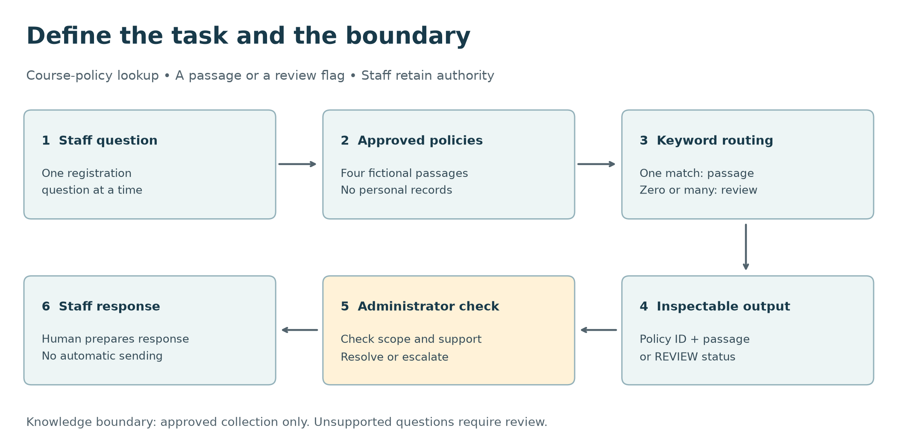
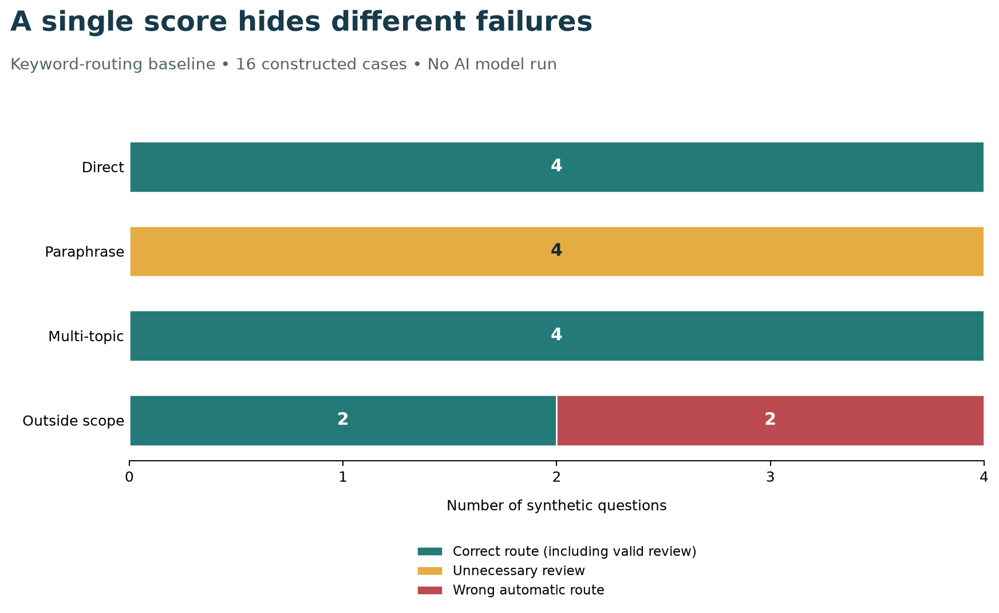

# AI Thinking and Problem Framing {#sec-ai-thinking-problem-framing}

::: {.cdi-message}
- **ID:** AI-001
- **Type:** Conceptual foundations and reproducible problem-framing exercise
- **Audience:** Learners, analysts, researchers, and practitioners beginning applied AI
- **Theme:** Turn a broad AI idea into a bounded task with evidence of usefulness
:::

## Learning objectives

By the end of this chapter, you will be able to:

1. distinguish an AI capability from a useful application;
2. describe a task in terms of its users, inputs, outputs, and intended action;
3. compare rules, search, predictive models, and generative approaches;
4. define a baseline, evaluation cases, and measurable acceptance criteria;
5. identify information boundaries, failure costs, and human review points; and
6. produce a one-page problem brief before building a prototype.

## Begin with a task people need to complete

“Build an AI assistant” describes a technology choice. It does not explain whose work should improve, what information the assistant may use, or how anyone will know that it helps.

Consider a training centre whose staff repeatedly answer questions about course registration. One proposal is to build a chatbot. A better starting point is to observe the work: staff find the relevant policy, check that it applies to the question, and explain the answer. Sometimes the published information is incomplete, and staff must refer the question to a coordinator.

That observation suggests a bounded first task:

> Help a course administrator locate the approved passage that answers a registration question, or identify that the question needs further review.

A searchable page might solve this task. A retrieval system might improve it. A language model might help draft an explanation after retrieval. The task determines what to compare; the technology does not define success.

The prototype in this chapter uses **fictional course policies and synthetic questions**. It illustrates problem framing and evaluation without using personal data, contacting an AI service, or making claims about a trained model's performance.

This course-policy task is the running example in the first chapters. It gives us a small document collection, observable errors, and a baseline that we can inspect. Later, we will transfer the same questions about source quality, evaluation, and human review to CDI research data, where the source documents and consequences differ.

## What makes a system an AI system?

AI is a broad field concerned with systems that perform tasks such as perception, language processing, reasoning, prediction, and planning. The OECD's explanatory memorandum describes AI systems in terms of how they infer outputs from inputs; those outputs can include predictions, content, recommendations, and decisions. The definition accommodates different levels of autonomy and does not require a conversational interface [@oecd2024ai-definition].

For this guide, four terms are useful:

| Term | Practical meaning | Example |
|---|---|---|
| Artificial intelligence | The wider field of systems performing tasks associated with intelligent behaviour | A system that interprets a question and proposes an answer |
| Machine learning | Methods that estimate patterns from data | A classifier learned from labelled support requests |
| Deep learning | Machine learning using multilayer neural networks | A neural model that represents text or images |
| Generative AI | Systems that produce content such as text, images, or audio | A model drafting an explanation from retrieved passages |

These terms overlap. Generative AI is not synonymous with all AI, and not every useful automation requires machine learning. Modern generative systems commonly use deep learning, but this chapter does not require training or running one.

### A model is one component of an application

A model transforms inputs into outputs. An application also has data access, interfaces, rules, error handling, review procedures, and people who act on its outputs.

For the course administrator, a fluent response is insufficient if it cites an outdated policy. A good model can still be part of an unreliable application when the wrong document is retrieved, the user cannot inspect the source, or an answer is sent without the necessary review.

Think of the complete workflow:

> **User need → bounded task → permitted information → method → checked output → action → feedback**

Each transition deserves a question. Is the input in scope? Is the information current? Does the evidence support the output? Can the user correct an error? What happens when the system cannot answer?

## Define the problem before selecting an approach

The NIST AI Risk Management Framework emphasizes understanding intended purposes, context, and relevant stakeholders, and evaluating systems in their intended settings [@tabassi2023ai-rmf]. This chapter turns that general principle into a practical brief; the worksheet is a teaching aid, not a certification checklist.

### User and affected people

Name the person who will use the output, and distinguish them from people affected by it. Here, the direct user is a course administrator; prospective learners are affected by any information they receive.

“Everyone” is rarely a useful first audience. A narrow audience makes vocabulary, accessibility, working conditions, and review responsibilities easier to specify.

### Task and unit of work

Describe one instance of work. In the running example, the unit is **one registration question checked against one approved policy collection**.

Avoid combining unrelated tasks into the first version. Answering policy questions, deciding admission, collecting payments, and predicting dropout are separate tasks with different evidence and consequences.

### Permitted inputs and knowledge boundary

Specify what the system receives and what it may consult. The example accepts a short English question and searches four fictional policy passages. It has no access to learner records, private messages, or live course availability.

An input boundary prevents hidden assumptions. If a question needs information outside the approved collection, the correct behaviour is to refer it for review. Adding a powerful model would not create missing institutional knowledge.

### Output contract

An output contract states what an acceptable result contains. Our baseline returns:

- the original question identifier;
- either a policy identifier or `REVIEW`;
- the selected policy passage, if any; and
- a status explaining whether there was one rule match, no match, or conflicting matches.

The first version returns source text rather than a generated paraphrase. This makes the evidence inspectable. A later draft-answer feature would need additional criteria for factual support, completeness, and misleading wording.

### Action and authority

The administrator reads the result, checks the passage, and decides how to respond. The prototype does not send messages, change enrolments, grant exceptions, or make decisions about eligibility.

“Human review” must identify a real step. Specify who checks what, what evidence they see, and whether they have time and authority to reject the output. A nominal reviewer who accepts every result is not a demonstrated safeguard.

### Constraints and failure consequences

Record constraints that could change the design: language, connectivity, response time, approved data sources, privacy, accessibility, and maintenance responsibilities.

For this task, a wrong policy citation could mislead a learner; unnecessary referral costs staff time. These errors are not equivalent. A design that refers uncertain cases can be useful even if it answers fewer questions automatically, provided that referral is reliable and staff capacity is adequate.

## Write a one-page problem brief

Use this sentence as the starting point:

> For **[user]**, given **[permitted input]**, produce **[defined output]** to support **[task or action]**. Compare against **[baseline]** using **[representative cases and criteria]**. Refer **[conditions]** to **[responsible person]**, within **[constraints]**.

A completed version for the example is:

> For course administrators, given a short registration question and an approved policy collection, return a relevant passage or a review flag so staff can prepare a supported response. Compare candidate approaches with keyword routing on policy questions, paraphrases, multi-topic requests, and questions outside the collection. Measure correct routing, incorrect automatic routing, and review volume. Staff check every result; admission decisions and personal records remain outside scope.

The included `data/reference/01-problem-brief-template.md` expands this into a reusable worksheet. Keep the brief short enough to review with the intended user. Where evidence is missing, write “to be measured” rather than inventing a success claim.

## Match the approach to the task

| Approach | Appropriate starting condition | Main limitation to examine |
|---|---|---|
| Explicit rule or lookup | Stable, clearly stated conditions map to known outputs | Brittle wording and incomplete rules |
| Search or retrieval | Answers already exist in an approved collection | Failure to retrieve the right, current source |
| Supervised prediction | Relevant examples have reliable target labels | Generalization, label quality, and data leakage |
| Generative model | The task needs flexible drafting or transformation | Unsupported, incomplete, or inconsistent content |
| Retrieval with generation | A draft must use an identifiable knowledge collection | Retrieval errors and unsupported synthesis |
| Human process | Judgment or missing context dominates the task | Capacity, consistency, and turnaround time |

These are starting points, not mutually exclusive categories. A workflow can combine search, rules, and a model. Retrieval does not guarantee that a generated answer is correct, and adding a model does not automatically improve a deterministic task.

### When to narrow or stop

Pause the prototype if there is no agreed task, no usable evidence for checking outputs, no permitted information source, or no owner for consequential errors. Also reconsider AI when a maintained FAQ or existing search interface already meets the need.

A useful first experiment should resolve a specific uncertainty: for example, whether paraphrased questions can be matched to the right policy. “Explore what AI can do” is too broad to provide a clear stopping condition.

## Design the evaluation before improving the method

A baseline is a reference method against which a new approach is compared. It might be the current manual workflow, a majority prediction, a keyword rule, or ordinary search. Its purpose is to establish what improvement means.

Use the same evaluation cases and output requirements when comparing approaches. If one method may consult extra documents or gets easier questions, a higher score does not isolate the value of the method.

### Cases should reflect the intended work

Include routine cases and cases that test boundaries:

- direct questions that use policy vocabulary;
- paraphrases that avoid expected keywords;
- questions covering multiple topics;
- questions with missing context;
- questions outside the approved collection; and
- supported languages and accessibility needs relevant to the real setting.

A small synthetic set is useful for debugging the workflow. It cannot establish population-level reliability, fairness, or production readiness. Later evaluation should use independently labelled, representative cases obtained through appropriate data handling.

Keep development cases separate from final evaluation cases. Once you use a case to revise rules or prompts, it becomes part of development. Repeatedly improving against the same small set creates an optimistic estimate of performance.

### Define metrics with denominators

For our routing task, use three quantities:

$$
\text{Correct routing rate} = \frac{\text{cases matching the expected route}}{\text{all cases}}.
$$

An expected route may be a policy identifier or `REVIEW`. Correct referral therefore counts as correct routing.

$$
\text{Incorrect automatic routing rate} = \frac{\text{wrong policy routes}}{\text{all automatic policy routes}}.
$$

$$
\text{Review rate} = \frac{\text{cases sent to review}}{\text{all cases}}.
$$

The second metric is undefined when there are no automatic routes; the script reports `NA` in that situation. Always show counts with rates. The denominator affects interpretation: a method that refers every question has no incorrect automatic routes, but may offer no time saving.

### Turn aspirations into acceptance criteria

“Accurate and fast” does not define an acceptance test. A prototype brief could instead say:

- every automatic result includes an inspectable approved passage;
- no case deliberately labelled outside scope receives an automatic policy route in the development suite;
- multi-topic requests are referred under the agreed single-passage contract; and
- a staff pilot measures correction time and referral workload before claiming time savings.

These are example development criteria, not universal performance thresholds. A real team must agree on error tolerances, sample sizes, service requirements, and escalation arrangements for its own setting.

## Worked example: evaluate a transparent baseline

The chapter's runnable example is a deterministic keyword router. It is intentionally simple so that every result can be traced to a rule. **It does not train an AI model.** It gives a later AI approach a concrete baseline to improve upon.

Four fictional policies cover registration, certificates, refunds, and course schedules. The synthetic test set contains 16 questions: four direct questions, four paraphrases, four multi-topic requests, and four questions outside the collection.

The script searches whole words in each question. One matching policy returns its passage; no matches or several policy matches return `REVIEW`.

```python
matches = [
    policy_id
    for policy_id, policy in policies.items()
    if tokens.intersection(policy["keywords"])
]
route = matches[0] if len(matches) == 1 else "REVIEW"
```

This displayed fragment is illustrative. The complete program is in `scripts/python/01-ai-problem-framing.py`. Plain code fences do not execute during Quarto rendering.

### Run the example

Use the Artificial Intelligence repository's own `.venv`, as described in the preface. The program uses the Python standard library and Matplotlib; Matplotlib is already listed in the guide's `requirements.txt`.

From the repository root, install the documented dependencies if needed, then run:

```bash
.venv/bin/python -m pip install -r requirements.txt
bash scripts/bash/01-ai-problem-framing.sh
```

The wrapper uses `.venv/bin/python` explicitly and stops with a useful message if the environment is missing. Alternatively, invoke the Python program directly with that interpreter:

```bash
.venv/bin/python scripts/python/01-ai-problem-framing.py
```

The program resolves paths from its own file location. It therefore writes to the intended repository even when called from a different working directory. No API key, network request, random seed, or downloaded dataset is needed: all input cases and rules are fixed and versionable. The inputs are fictional policies in `data/reference/01-course-policies.json` and 16 synthetic, labelled questions in `data/reference/01-framing-cases.csv`; they are not empirical observations. The reusable worksheet is `data/reference/01-problem-brief-template.md`.

### Inspect the outputs

| File | Purpose |
|---|---|
| `results/tables/01-routing-results.csv` | Every question, expected route, actual route, passage, and error flags |
| `results/tables/01-routing-summary.csv` | Counts and rates overall and by case family |
| `results/figures/01-ai-task-workflow.png` | The bounded task and its human decision point |
| `results/figures/01-baseline-routing-results.png` | Correct routes, unnecessary reviews, and wrong automatic routes |
| `results/tables/01-run-metadata.json` | Runtime versions and input hashes for tracing the run |

{#fig-ai-task-workflow fig-alt="Six boxes connect a staff question, approved policies, keyword routing, a passage or review flag, an administrator check, and a staff response. The figure labels the knowledge boundary and states that no message is sent automatically." width=100%}

@fig-ai-task-workflow makes the boundary visible: retrieving a passage supports the administrator's work, while the response remains a human action.

{#fig-ai-routing-results fig-alt="Each question family contains four cases. Direct questions have four correct routes. Paraphrases have four unnecessary reviews. Multi-topic questions have four correct reviews. Outside-scope questions have two correct reviews and two wrong automatic routes." width=100%}

### Interpret the result

The fixed example produces:

| Quantity | Result | Interpretation |
|---|---:|---|
| Correct routes | 10 / 16 (62.5%) | Includes six correct referrals and four correct policy routes |
| Automatic policy routes | 6 / 16 (37.5%) | Four are correct; two are wrong |
| Incorrect automatic routing rate | 2 / 6 (33.3%) | One third of automatic routes fail on this tiny set |
| Review rate | 10 / 16 (62.5%) | Six reviews are expected; four are avoidable misses |

The aggregate correct-routing rate hides two different failures. The router misses all four paraphrases because they avoid its keywords. It also routes “birth certificate” and “bus schedule” questions to course policies because isolated keywords do not establish meaning.

The two wrong automatic routes violate the example development criterion for outside-scope questions. The baseline is therefore useful as an experiment, but it does not meet that criterion.

The chart uses counts rather than percentages because each family contains only four cases. The dataset was constructed to illustrate failure modes; the family frequencies do not represent actual demand. Do not interpret the 33.3% result as a forecast of real-world error. The outputs are reproducible from the supplied source and inputs, and the run metadata records runtime versions and SHA-256 hashes. Inspect the CSVs if you need the case-level counts behind the table.

### Decide what the evidence supports

This run supports a limited conclusion: keyword overlap alone cannot reliably distinguish the intended questions in this test set. It does not prove that a language model will solve the problem.

Possible next experiments include improving ordinary search, introducing explicit topic disambiguation, or comparing semantic retrieval on a separate set of questions. A generated draft would require additional evaluation of factual support and wording. Record the reason for each change and preserve the baseline outputs.

The `REVIEW` route also needs care. It groups ambiguous questions, missing coverage, and unmatched wording under one operational action. A later version might distinguish these causes to help staff resolve them, but only if the extra categories improve the workflow.

## Common framing mistakes

| Mistake | Why it weakens the project | Better framing |
|---|---|---|
| “Use the strongest model” | Names a component without defining value | Specify the task and compare measured outcomes |
| “Answer any question” | Hides the knowledge and authority boundaries | Name approved sources and referral conditions |
| “The answer sounds right” | Fluency is not evidence of support | Check it against an agreed source and rubric |
| “A person will review it” | Omits the reviewer's actual work | Specify evidence, time, authority, and escalation |
| “It scored well on our examples” | Development cases can overstate reliability | Reserve independent evaluation cases |
| “It will save staff time” | Omits checking and correction costs | Measure the complete task, including rework |

A predictive association also does not establish the effect of an intervention. If a later model predicts which learners may disengage, that prediction alone does not show which support action will help them. The intervention question needs its own evidence and study design.

## Check your understanding

1. Why is “build a course chatbot” less useful than a bounded problem statement?
2. Why can a system that sends every case to review avoid wrong automatic routes without improving the workflow?
3. Does returning a correct passage prove that a generated answer based on it would be correct?
4. Which example result shows that a keyword can match while the question remains outside scope?

::: {.callout-note collapse="true"}
## Suggested answers

1. It leaves the user, permitted sources, output, action, and success criteria unspecified.
2. It transfers all work to staff. Review capacity and total task time must also be measured; the wrong-automatic-route rate has no denominator when there are no automatic routes.
3. No. Generation can omit a condition, misstate the passage, or add unsupported claims. Retrieval and answer quality require separate checks.
4. The birth-certificate and bus-schedule questions match course-policy keywords but request information absent from the collection.
:::

## Try it yourself: produce a reviewable problem brief

Choose a modest task from your own work: locating an approved procedure, routing support questions, or extracting fields from a standard form.

1. Complete `data/reference/01-problem-brief-template.md` in a separate copy.
2. Define the output contract and at least three conditions requiring review.
3. Name a simple baseline and explain why it is a fair comparison.
4. Draft eight permitted, non-sensitive development cases: four routine, two ambiguous, and two outside scope. Provide expected outputs and a short reason for each.
5. Define two error measures and one workload measure, each with a denominator or unit.
6. Ask a colleague familiar with the task to challenge the scope and labels before implementation.

Your deliverable is the completed brief and labelled case table. You do not need an AI service to complete this exercise.

For an optional coding extension, add new synthetic cases to a copy of the chapter dataset and rerun the workflow. Keep the original set for comparison. If you change the routing rules after inspecting those cases, record them as development cases and create a fresh evaluation set for any later performance claim.

## Reproduce and verify this chapter

From the repository root, after running the example above, render the chapter with:

```bash
quarto render 01-ai-thinking-and-problem-framing.qmd
```

Rendering uses the generated figures but does not execute the displayed code fences or recreate the results. Check that the figures and table descriptions agree with the generated CSVs. The supplied example was run and its stated counts checked; both figures were visually inspected, and the chapter rendered as standalone HTML with Quarto 1.7.32. A full-book render is a separate integration check once all chapters and assets are in the repository.

## Chapter checklist

- [ ] I can explain the difference between a model capability and application usefulness.
- [ ] I can identify the direct user and people affected by the output.
- [ ] I have defined the task, unit of work, input boundary, and output contract.
- [ ] I can explain why a simple baseline belongs in an AI project.
- [ ] I can separate model or routing quality from workload and operational usefulness.
- [ ] I can identify which results require review and who performs it.
- [ ] I can reproduce the example and inspect its row-level errors.
- [ ] I understand why this synthetic demonstration does not establish deployment readiness.

## Key takeaways

A professional AI project begins with a bounded task and a way to judge the result. Inputs, outputs, permitted knowledge, human authority, and failure conditions are design decisions. A baseline makes improvement measurable, while row-level error analysis explains what an aggregate score hides. The appropriate next step follows from evidence about the task.

## Looking ahead

Chapter 02, **Data, Models, Training and Inference**, explains how data become learning signals, what a model represents, and how training differs from using a model to produce an output. The problem brief from this chapter provides the context for deciding which data and outputs matter.
