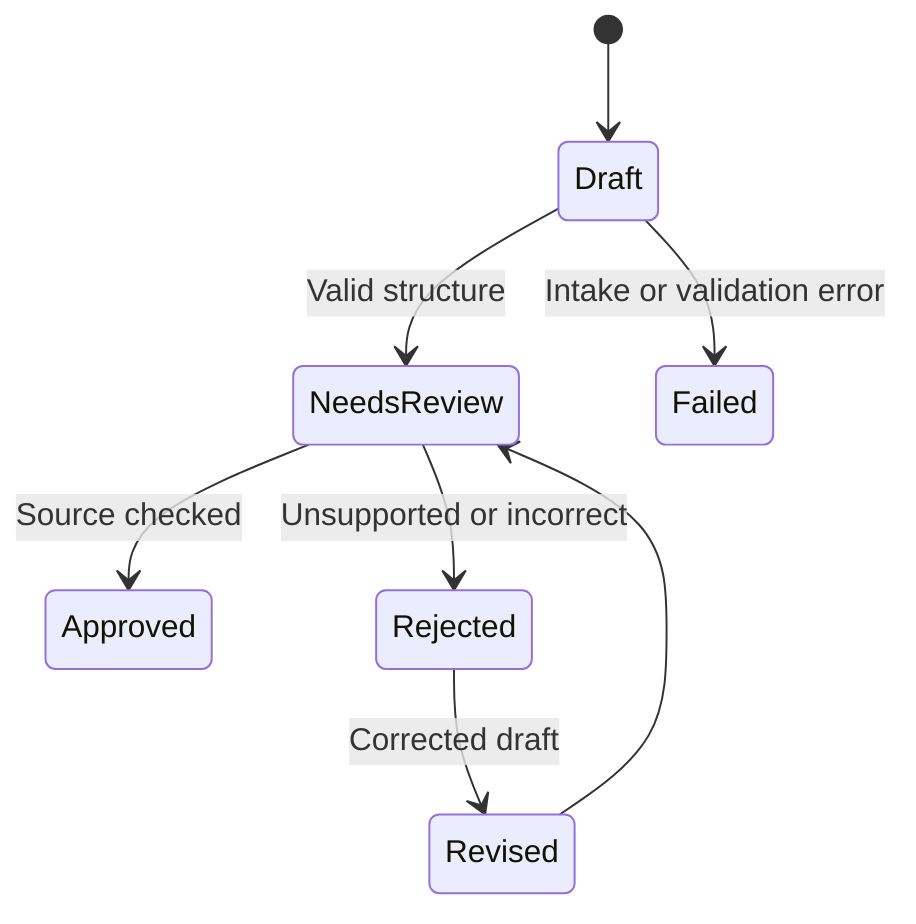

# From Prototype to Practical Application {#sec-from-prototype-to-practical}

::: {.cdi-message}
- **ID:** AI-L15
- **Type:** Next steps
- **Focus:** Decide whether and how a tested AI prototype can become a dependable application
- **Output:** A readiness assessment and staged improvement plan
:::

## A promising result is a starting point

The hackathon produced a focused prototype, reviewed its outputs, and compared it with a baseline. If it helped a user, the next question is what would be required for dependable use beyond those test cases. The answer depends on the real users, documents, consequences of error, service constraints, and people who will maintain the workflow.

Our continuing example drafts four fields from an approved article, with passage references and a reviewer decision. The prototype may work on readable articles tested during the hackathon. Broader use could introduce new article formats, larger collections, restricted documents, changing model behavior, and more reviewers. Each expansion changes what must be demonstrated.

A prototype should be described by the evidence it has earned. “Works on our pilot cases with mandatory review” is a useful and honest outcome. It is not yet a claim that the system handles every article or can produce unreviewed summaries.

## Decide what the pilot established

Begin with the decision record from Chapter 14. Separate observed evidence from assumptions:

| Question | Evidence from the pilot | Remaining question |
|---|---|---|
| Does the source path work? | Article and passage IDs resolve in tested cases | Will extraction hold across intended formats? |
| Are fields supported? | Reviewer judgments on reserved cases | How often do unsupported claims occur in broader use? |
| Is it useful? | Time and corrections compared with the baseline | Does the benefit persist with other reviewers and articles? |
| Are boundaries respected? | Tests for absent evidence and misleading source text | Will the controls work with a larger collection and more tools? |
| Can it be maintained? | Recorded prompts and run configurations | Who owns changes, reviews incidents, and monitors quality? |

If the pilot did not meet its own criteria, improve or narrow the workflow before expanding access. A clearer interface or faster model will not resolve an unexamined evidence problem.

## Expand evaluation in stages

A practical application needs evidence from conditions resembling its intended use. Add articles from relevant disciplines, lengths, layouts, languages, and publication types. Include missing fields, difficult qualifications, tables, figures, scans, and cases with similar article titles if those are in scope. Keep an independent reference record and a reserved set that has not been used to tune prompts or retrieval.

Evaluate the complete path: intake, extraction, passage selection, generation, validation, source review, and final approval. Report claim support, coverage, critical errors, false abstentions, reviewer time, and cost. Inspect results separately for conditions that matter, such as scans versus selectable text. A single overall percentage can hide predictable failures in one type of document.

Choose acceptance criteria with the users and responsible domain reviewers. For high-consequence use, evidence and oversight must be stronger than for a low-stakes drafting aid. Continue to use the manual or search-assisted baseline so added complexity remains justified.

## Make the source contract reliable

A usable system needs a stable input contract. Define which documents are eligible, how article identity is verified, how pages and passages are labeled, and what happens when extraction is incomplete. Keep the original document available for review. When an article changes, retain a version or content identifier so an old summary is not silently attributed to new text.

If retrieval is used, measure whether it finds the necessary evidence. Keep article filters, passage IDs, and retrieval version visible in run records. A generation model cannot repair a missing section it never saw. If a figure or table contributes a finding, ensure its caption, units, and surrounding text are available to the reviewer.

## Design an operational review process

Human review must be workable at the expected volume. Give reviewers clear source links and a way to correct, reject, or approve each field. Do not label a generated draft as approved merely because it passed a JSON or citation-ID check. Specify which errors require a second reviewer, a manual summary, or suspension of the workflow.

Track the status of each summary, for example:

The transition to **Approved** requires the actual review procedure. Record who made the decision, which source version was checked, and whether corrections were made. Fit the process to the project's permissions and the consequence of a mistaken summary.

## Plan for model and service changes

Models, software dependencies, source collections, and document formats can change. Version prompts, retrieval indexes, output contracts, and model identifiers. Before replacing a model or changing a prompt, run a stable comparison set and inspect new errors as well as gains. Preserve previous results so regressions are visible.

Define a fallback when a service is unavailable or a response cannot be validated. For the article example, the reviewer can complete the manual template. A fallback makes the application useful without requiring the AI component to succeed on every request.

Monitor real reviewed outcomes after initial use: unsupported claims, corrected fields, missing passages, abstentions, processing failures, reviewer effort, and complaints. Use those records to decide when to improve, narrow, pause, or retire the workflow. Monitoring must respect the data access and retention rules established in Chapter 10.

## Account for cost, delay, and access

The cost of a completed summary includes extraction, search, model calls, retries, storage, and reviewer time. Measure delays from article intake to approved output, not just generation latency. A slower automated draft may still help if it reduces effort; a fast draft may be costly if every claim requires lengthy correction.

Consider accessibility for the intended users. Reviewers need readable source passages, clear status labels, and a way to understand why a field is unsupported. If the tool serves users with different network conditions or languages, test those conditions rather than assuming the pilot setup represents them.

## Set ownership and documentation

Assign responsibility for source permissions, technical operation, review criteria, evaluation, and changes to the model or prompts. Document:

- the supported user task and eligible inputs;
- the data flow and retention rules;
- the output contract and human approval process;
- the baseline and acceptance criteria;
- known limitations and excluded cases;
- the response to extraction, retrieval, or model failures; and
- the process for changing and re-evaluating the workflow.

Keep a user-facing explanation concise: what the application can help draft, what sources it uses, and what a reviewer still checks. Keep technical records detailed enough for the responsible team to investigate errors and reproduce comparisons.

## Choose a staged path

A sensible progression for the article-summary example is:

| Stage | Scope | Evidence needed to advance |
|---|---|---|
| Hackathon prototype | A small approved case set, mandatory review | Working path and documented pilot results |
| Limited pilot | More eligible articles and a few designated reviewers | Consistent support, useful time savings, and manageable errors |
| Controlled use | Defined intake, review queue, monitoring, and fallback | Operational records and stable performance in scope |
| Wider application | Broader users or article types | New evaluation, permissions, capacity, and ownership for that scope |

Advancement is a decision, not an automatic calendar milestone. A system can remain valuable as a reviewer aid at limited scale. If evidence favors the baseline, retaining a simpler process is a legitimate outcome.

## Practice: write a readiness assessment

Using your Chapter 14 results, prepare a short readiness assessment with these headings:

1. **Current evidence:** What has been tested, on how many and which cases?
2. **Supported scope:** Which users, inputs, and outputs are justified today?
3. **Important gaps:** Which failures, formats, or permissions remain unresolved?
4. **Review and fallback:** Who approves results, and what happens on failure?
5. **Operations:** Who owns versions, access, cost, monitoring, and corrections?
6. **Next experiment:** What is the smallest evaluation that would resolve the most important uncertainty?
7. **Decision:** Continue within scope, revise, narrow, use the baseline, or stop.

Make the next experiment testable. “Improve accuracy” is too broad; “test whether preserving longer Results passages reduces omitted qualifications without increasing unsupported claims on a reserved set” identifies a change and a way to judge it.

## Chapter checklist

- [ ] I can distinguish what the pilot demonstrated from untested assumptions.
- [ ] I have defined eligible inputs, review steps, and failure responses.
- [ ] I know what additional cases and measures would justify broader use.
- [ ] I have assigned ownership for data, changes, evaluation, and monitoring.
- [ ] I can make a staged decision that reflects the evidence and the baseline.

## Closing reflection

The path through this guide began with a user's task, not a model. It moved through data and method choice, generated and retrieved evidence, output checks, human review, and a focused prototype. The same discipline carries the work forward: define the use, compare a simple baseline, test representative cases, inspect failures, and describe limits plainly.

A working prototype is valuable when it helps answer a real question. A practical AI application earns trust through repeated evidence, clear responsibility, and a reliable way for people to inspect and correct its outputs.
